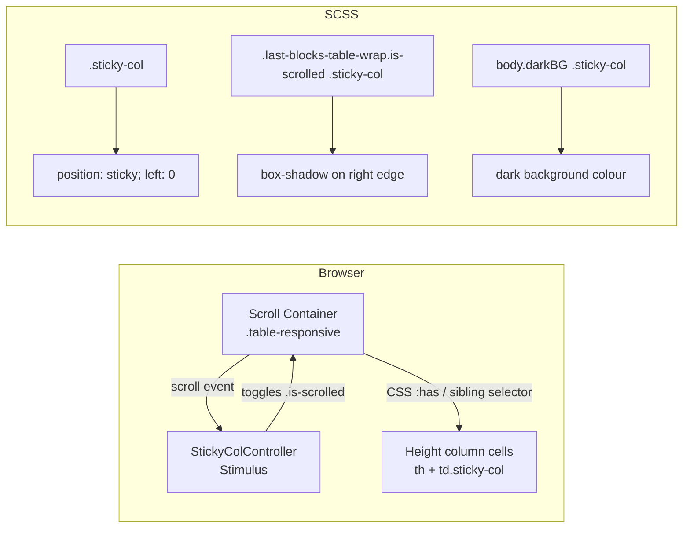

# Design Document: Sticky Height Column

## Overview

This feature pins the Height column of the Latest Blocks table to the left edge of its scroll container so it remains visible during horizontal scrolling. A drop-shadow appears on the column's right edge whenever the table is scrolled, signalling that content is hidden behind it. The shadow disappears when the table is back at its leftmost position. Both the sticky background and the shadow adapt to the active light or dark theme.

The implementation is entirely frontend — no backend changes are required. It touches three layers:

1. **Template** (`home_latest_blocks.tmpl`) — adds CSS classes and a Stimulus controller attribute to the scroll container.
2. **SCSS** (`home.scss`) — defines sticky positioning, background colours per theme, and the shadow styles.
3. **Stimulus controller** (`sticky_col_controller.js`) — observes scroll position and toggles a CSS class on the container to drive the shadow.

## Architecture

The scroll container already exists as Bootstrap's `.table-responsive` div. The Stimulus controller is attached to that element. On every `scroll` event it checks `scrollLeft > 0` and toggles the class `is-scrolled` on itself. SCSS rules keyed on that class show or hide the shadow.

## Components and Interfaces

### Template changes — `home_latest_blocks.tmpl`

- Add `data-controller="sticky-col"` to the `.table-responsive` wrapper div.
- Add class `last-blocks-table-wrap` to the same div (used as a SCSS hook to scope shadow rules without relying on the Stimulus identifier).
- Add class `sticky-col` to every Height `<th>` and every Height `<td>` (the first cell in each row type, including SKA sub-rows).

### Stimulus controller — `sticky_col_controller.js`

New file: `cmd/dcrdata/public/js/controllers/sticky_col_controller.js`

| Member         | Type           | Purpose                                                       |
| -------------- | -------------- | ------------------------------------------------------------- |
| `connect()`    | lifecycle      | Attaches the `scroll` listener to `this.element`              |
| `disconnect()` | lifecycle      | Removes the `scroll` listener                                 |
| `_onScroll()`  | private method | Toggles `is-scrolled` on `this.element` based on `scrollLeft` |

The controller is auto-discovered by Stimulus via the existing `require.context` in `index.js` — no registration change needed.

### SCSS changes — `home.scss`

New rules added to the existing `home.scss` file:

- `.sticky-col` — `position: sticky; left: 0; z-index: 1` plus light-theme background.
- `.last-blocks-table-wrap.is-scrolled .sticky-col` — `box-shadow` on the right edge.
- `body.darkBG` overrides for both background and shadow color.

## Data Models

No new data models. The feature is purely presentational. The only runtime state is the boolean `scrollLeft > 0`, which is derived directly from the DOM and never stored.

## Correctness Properties

_A property is a characteristic or behavior that should hold true across all valid executions of a system — essentially, a formal statement about what the system should do. Properties serve as the bridge between human-readable specifications and machine-verifiable correctness guarantees._

### Property 1: Sticky positioning applied to all Height column cells

_For any_ row in the Latest Blocks table — header row, regular block row, or SKA sub-row — the first cell (Height column) must have `position: sticky` and `left: 0` in its computed style.

**Validates: Requirements 1.1, 1.3**

### Property 2: Sticky cells have an opaque background

_For any_ Height column cell with `position: sticky`, the computed `background-color` must be a non-transparent colour so that scrolled content is covered and not visible through the cell.

**Validates: Requirements 1.2**

### Property 3: Scroll state drives shadow class (round-trip)

_For any_ scroll position of the Scroll_Container: when `scrollLeft > 0` the container must carry the `is-scrolled` class, and when `scrollLeft === 0` the `is-scrolled` class must be absent. Scrolling right then back to zero must leave the container without the class.

**Validates: Requirements 2.1, 2.2, 2.4**

## Error Handling

This feature has no network calls or data mutations, so error handling is minimal:

- If the browser does not support `position: sticky` (effectively no modern browser in use today), the column degrades gracefully — it scrolls with the rest of the table. No JS error is thrown.
- If the Stimulus controller fails to connect (e.g. JS disabled), the shadow never appears but the sticky CSS still applies. The table remains fully functional.
- The `scroll` event listener is removed in `disconnect()` to prevent memory leaks when Turbolinks navigates away from the page.

## Testing Strategy

### Unit tests

There are no Go backend changes, so no Go unit tests are needed.

For the Stimulus controller, a focused unit test verifies the class-toggle logic:

- Given a mock scroll container element, calling `_onScroll()` with `scrollLeft = 1` adds `is-scrolled`.
- Calling `_onScroll()` with `scrollLeft = 0` removes `is-scrolled`.
- Calling `_onScroll()` twice with `scrollLeft > 0` leaves `is-scrolled` present (idempotent).

### Property-based tests

Property-based testing library: **fast-check** (already available in the JS ecosystem; add as a dev dependency).

Each property test runs a minimum of 100 iterations.

**Property 1 — Sticky positioning applied to all Height column cells**
Tag: `Feature: sticky-height-column, Property 1: sticky positioning applied to all Height column cells`

Generate a random number of block rows (1–20) and a random number of SKA sub-rows per block (0–5). Render the table fragment into a DOM fixture. For every cell with `data-type="height"` or the first `<td>` of a `.ska-sub-row`, assert `getComputedStyle(cell).position === 'sticky'` and `getComputedStyle(cell).left === '0px'`.

**Property 2 — Sticky cells have an opaque background**
Tag: `Feature: sticky-height-column, Property 2: sticky cells have an opaque background`

Using the same generated table fixtures as Property 1, for every `.sticky-col` cell assert that `getComputedStyle(cell).backgroundColor` is not `rgba(0, 0, 0, 0)` (transparent).

**Property 3 — Scroll state drives shadow class (round-trip)**
Tag: `Feature: sticky-height-column, Property 3: scroll state drives shadow class`

Generate random integer `scrollLeft` values in the range [0, 2000]. For each value, set `element.scrollLeft` on a mock container and dispatch a `scroll` event. Assert:

- `scrollLeft > 0` → container has class `is-scrolled`
- `scrollLeft === 0` → container does not have class `is-scrolled`

Also generate a random sequence of scroll positions ending with 0 and assert the class is absent after the final event.
