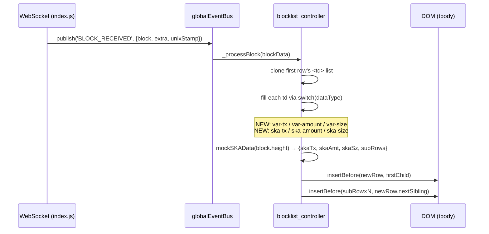

# Design Document: websocket-block-var-ska

## Overview

When a new block arrives over the WebSocket, `blocklist_controller.js` clones the first row's `<td>` structure and fills each cell via a `switch` on `td.dataset.type`. The six VAR/SKA column types (`var-tx`, `var-amount`, `var-size`, `ska-tx`, `ska-amount`, `ska-size`) fall through to the `default` branch, which does `block[dataType]` — a key that doesn't exist on the payload — leaving those cells blank. This design covers the JS-side fix: extending the switch, porting `mockSKAData` to JS, and inserting SKA sub-rows after the main row.

## Main Algorithm/Workflow



## WebSocket Payload Shape

`index.js` parses the raw JSON and publishes `blockData` with this shape:

```javascript
blockData = {
  block: {           // BlockInfo (embeds BlockBasic)
    height: 123456,  // int64  → block.height
    hash: "...",
    tx: 5,           // int    → block.tx  (used for var-tx)
    size: 12345,     // int32  → block.size
    total: 1234.5,   // float64 → block.total (used for var-amount)
    formatted_bytes: "12.3 kB",
    time: "2024-01-01T00:00:00Z",
    votes: 5,
    tickets: 3,
    revocations: 0,
    // ...other BlockInfo fields
  },
  extra: { /* HomeInfo — not needed for this feature */ },
  // added by index.js:
  block.unixStamp: 1704067200
}
```

Key mapping from Go JSON tags to JS property names:

| Go field (`BlockBasic`) | JSON tag   | JS access      | Used for     |
| ----------------------- | ---------- | -------------- | ------------ |
| `Transactions`          | `"tx"`     | `block.tx`     | `var-tx`     |
| `Total`                 | `"total"`  | `block.total`  | `var-amount` |
| `Size`                  | `"size"`   | `block.size`   | `var-size`   |
| `Height`                | `"height"` | `block.height` | SKA mock     |

## Core Interfaces / Types

```javascript
/**
 * @typedef {Object} SKASubRow
 * @property {string} tokenType  - e.g. "SKA-1"
 * @property {string} txCount    - pre-formatted aggregate tx count
 * @property {string} amount     - pre-formatted aggregate amount
 * @property {string} size       - pre-formatted aggregate size
 */

/**
 * @typedef {Object} SKAData
 * @property {string}       skaTx    - aggregate tx count string
 * @property {string}       skaAmt   - aggregate amount string
 * @property {string}       skaSz    - aggregate size string
 * @property {SKASubRow[]}  subRows  - per-token breakdown; empty when height % 9 === 0
 */
```

## Key Functions with Formal Specifications

### `mockSKAData(height)`

Direct port of `home_mock.go:mockSKAData`. Uses the same token table and offset arithmetic so JS-rendered rows are visually identical to server-rendered rows.

```javascript
function mockSKAData(height) {
  // INPUT:  height — integer block height
  // OUTPUT: SKAData object
}
```

**Preconditions:**

- `height` is a safe integer (`Number.isSafeInteger(height)`)

**Postconditions:**

- If `height % 9 === 0`: returns `{ skaTx: '0', skaAmt: '0', skaSz: '0', subRows: [] }`
- Otherwise: `subRows.length === 3` (one per mock token), aggregate values equal the sum of per-token values
- All string fields are non-empty
- `subRows` is always an array (never null/undefined)

**Loop invariant (token iteration):**

- After processing `k` tokens: `aggTx === sum of tx[0..k-1]`, `aggAmt === sum of amt[0..k-1]`, `aggSz === sum of sz[0..k-1]`

**Algorithmic pseudocode:**

```pascal
CONST mockSKATokens = [
  { name: "SKA-1", txs: 42,  amount: 1_250_000,     size: 8_400 },
  { name: "SKA-2", txs: 17,  amount: 450_000,        size: 3_200 },
  { name: "SKA-3", txs: 5,   amount: 2_100_000_000,  size: 1_100 }
]

PROCEDURE mockSKAData(height)
  IF height % 9 = 0 THEN
    RETURN { skaTx: "0", skaAmt: "0", skaSz: "0", subRows: [] }
  END IF

  offset ← height % 10
  aggTx  ← 0
  aggAmt ← 0.0
  aggSz  ← 0.0
  subRows ← []

  FOR EACH tok IN mockSKATokens DO
    -- INVARIANT: aggTx/aggAmt/aggSz = sum of all previously processed tokens
    tx  ← tok.txs + offset
    amt ← tok.amount * (1 + offset / 100)
    sz  ← tok.size + offset * 10

    aggTx  ← aggTx + tx
    aggAmt ← aggAmt + amt
    aggSz  ← aggSz + sz

    subRows.push({
      tokenType: tok.name,
      txCount:   String(tx),
      amount:    humanize.threeSigFigs(amt),
      size:      humanize.threeSigFigs(sz)
    })
  END FOR

  RETURN {
    skaTx:   String(aggTx),
    skaAmt:  humanize.threeSigFigs(aggAmt),
    skaSz:   humanize.threeSigFigs(aggSz),
    subRows: subRows
  }
END PROCEDURE
```

> Note: `amt` and `sz` use `float64`-range values (max ~2.1B), so standard JS `number` is safe here. The precision concern from `tech.md` applies to the real backend amounts (15 integer + 18 decimal digits), not to this mock.

---

### Extended `switch` cases in `_processBlock`

```javascript
// INPUT:  td.dataset.type, block object
// OUTPUT: newTd populated with correct content/attributes
```

**Preconditions:**

- `block.tx` is a number
- `block.total` is a number
- `block.size` is a number (bytes, integer)
- `block.height` is a safe integer

**Postconditions for each new case:**

| `dataType`   | `newTd.textContent`                  | Extra attributes / children                                      |
| ------------ | ------------------------------------ | ---------------------------------------------------------------- |
| `var-tx`     | `String(block.tx)`                   | none                                                             |
| `var-amount` | `humanize.threeSigFigs(block.total)` | none                                                             |
| `var-size`   | `humanize.bytes(block.size)`         | none                                                             |
| `ska-tx`     | — (button child, see below)          | `ska-clickable` class + `data-action` when `hasSKAData === true` |
| `ska-amount` | — (button child, see below)          | same                                                             |
| `ska-size`   | — (button child, see below)          | same                                                             |

**SKA cell construction pseudocode:**

```pascal
PROCEDURE buildSKACell(newTd, sourceTd, value, hasSKAData)
  IF hasSKAData THEN
    newTd.classList.add("ska-clickable")
    newTd.dataset.action = "click->ska-accordion#toggle"
    btn ← createElement("button")
    btn.type = "button"
    btn.className = "link-button"
    btn.textContent = value
    newTd.appendChild(btn)
  ELSE
    newTd.textContent = value
  END IF
END PROCEDURE
```

---

### Sub-row insertion

```javascript
// INPUT:  tbody element, newRow <tr>, subRows SKASubRow[], blockHeight number
// OUTPUT: N <tr class="ska-sub-row"> elements inserted immediately after newRow
```

**Preconditions:**

- `newRow` is already a child of `tbody`
- `subRows` is an array (may be empty)

**Postconditions:**

- If `subRows.length === 0`: no sub-rows inserted
- If `subRows.length > 0`: exactly `subRows.length` `<tr>` elements with class `ska-sub-row` are inserted in order immediately after `newRow`
- Each sub-row has `data-ska-accordion-target="subRow"` and `data-block-id="{blockHeight}"`
- Sub-row cell structure mirrors the template: 7 empty `<td>` cells, then a `colspan="3"` token-type cell, then tx/amount/size cells

**Sub-row construction pseudocode:**

```pascal
PROCEDURE insertSKASubRows(tbody, newRow, subRows, blockHeight)
  insertRef ← newRow.nextSibling   -- insertion anchor (null = append)

  FOR EACH sub IN subRows DO
    tr ← createElement("tr")
    tr.className = "ska-sub-row"
    tr.dataset.skaAccordionTarget = "subRow"
    tr.dataset.blockId = String(blockHeight)

    -- 7 empty spacer cells (cols 1-7: sticky, tx, votes, tickets, rev, size, age)
    FOR i ← 1 TO 7 DO
      tr.appendChild(createElement("td"))
    END FOR

    -- token label spanning VAR columns (cols 8-10)
    labelTd ← createElement("td")
    labelTd.colSpan = 3
    labelTd.className = "text-end fs13 fw-medium"
    labelTd.textContent = sub.tokenType
    tr.appendChild(labelTd)

    -- SKA tx count (col 11)
    txTd ← createElement("td")
    txTd.className = "text-center group-ska-col"
    txTd.textContent = sub.txCount
    tr.appendChild(txTd)

    -- SKA amount (col 12)
    amtTd ← createElement("td")
    amtTd.className = "text-end"
    amtTd.textContent = sub.amount
    tr.appendChild(amtTd)

    -- SKA size (col 13)
    szTd ← createElement("td")
    szTd.className = "text-end pe-2"
    szTd.textContent = sub.size
    tr.appendChild(szTd)

    tbody.insertBefore(tr, insertRef)
    insertRef ← tr.nextSibling
  END FOR
END PROCEDURE
```

## Full `_processBlock` Control Flow

```pascal
PROCEDURE _processBlock(blockData)
  IF NOT hasTableTarget THEN RETURN END IF

  block ← blockData.block
  rows  ← tableTarget.querySelectorAll("tr")
  IF rows.length = 0 THEN RETURN END IF

  tr         ← rows[0]
  lastHeight ← parseInt(tr.dataset.height)

  IF block.height = lastHeight THEN
    tableTarget.removeChild(tr)
  ELSE IF block.height = lastHeight + 1 THEN
    tableTarget.removeChild(rows[rows.length - 1])
  ELSE
    RETURN
  END IF

  -- Compute SKA data once (used by all three SKA cells)
  { skaTx, skaAmt, skaSz, subRows } ← mockSKAData(block.height)
  hasSKAData ← subRows.length > 0

  newRow ← createElement("tr")
  newRow.dataset.height    = block.height
  newRow.dataset.linkClass = tr.dataset.linkClass
  newRow.dataset.skaAccordionTarget = "blockRow"
  newRow.dataset.blockId   = String(block.height)

  FOR EACH td IN tr.querySelectorAll("td") DO
    newTd ← createElement("td")
    newTd.className      = td.className
    newTd.dataset.type   = td.dataset.type

    SWITCH td.dataset.type
      CASE "age":
        newTd.dataset.age        = block.unixStamp
        newTd.dataset.timeTarget = "age"
        newTd.textContent        = humanize.timeSince(block.unixStamp)

      CASE "height":
        link ← createElement("a")
        link.href      = "/block/" + block.height
        link.textContent = block.height
        link.classList.add(tr.dataset.linkClass)
        newTd.appendChild(link)

      CASE "size":
        newTd.textContent = humanize.bytes(block.size)

      CASE "value":
        newTd.textContent = humanize.threeSigFigs(block.TotalSent)

      CASE "time":
        newTd.textContent = humanize.date(block.time, false)

      -- NEW CASES:
      CASE "var-tx":
        newTd.textContent = String(block.tx)

      CASE "var-amount":
        newTd.textContent = humanize.threeSigFigs(block.total)

      CASE "var-size":
        newTd.textContent = humanize.bytes(block.size)

      CASE "ska-tx":
        buildSKACell(newTd, td, skaTx, hasSKAData)

      CASE "ska-amount":
        buildSKACell(newTd, td, skaAmt, hasSKAData)

      CASE "ska-size":
        buildSKACell(newTd, td, skaSz, hasSKAData)

      DEFAULT:
        newTd.textContent = block[td.dataset.type]
    END SWITCH

    newRow.appendChild(newTd)
  END FOR

  tableTarget.insertBefore(newRow, tableTarget.firstChild)
  insertSKASubRows(tableTarget, newRow, subRows, block.height)
END PROCEDURE
```

## Example Usage

```javascript
// Simulated BLOCK_RECEIVED payload (as published by index.js)
const blockData = {
  block: {
    height: 900, // 900 % 9 === 0 → no SKA data
    hash: "abc123",
    tx: 7,
    size: 15000,
    total: 3142.5,
    time: "2024-06-01T12:00:00Z",
    unixStamp: 1717243200,
    votes: 5,
    tickets: 2,
    revocations: 0,
    formatted_bytes: "14.6 kB",
  },
};
// → mockSKAData(900) returns { skaTx:'0', skaAmt:'0', skaSz:'0', subRows:[] }
// → hasSKAData = false → SKA cells get plain textContent, no button, no sub-rows

const blockData2 = {
  block: {
    height: 901,
    tx: 4,
    size: 9800,
    total: 820.0,
    unixStamp: 1717243205 /* ... */,
  },
};
// → mockSKAData(901): offset = 1
//   SKA-1: tx=43, amt=1_262_500, sz=8_410
//   SKA-2: tx=18, amt=454_500,   sz=3_210
//   SKA-3: tx=6,  amt=2_121_000_000, sz=1_110
//   aggTx=67, aggAmt≈2.124B, aggSz≈12.73k
//   → skaTx='67', skaAmt='2.12B', skaSz='12.7k'
//   → hasSKAData = true → SKA cells get <button> + ska-clickable class
//   → 3 ska-sub-row <tr> elements inserted after main row
```

## Correctness Properties

_A property is a characteristic or behavior that should hold true across all valid executions of a system — essentially, a formal statement about what the system should do. Properties serve as the bridge between human-readable specifications and machine-verifiable correctness guarantees._

### Property 1: VAR cells are populated from block payload

_For any_ block payload received over WebSocket, the `var-tx` cell text equals `String(block.tx)`, the `var-amount` cell text equals `humanize.threeSigFigs(block.total)`, and the `var-size` cell text equals `humanize.bytes(block.size)`.

**Validates: Requirements 1.1, 1.2, 1.3**

### Property 2: mockSKAData zero-activity invariant

_For any_ block height `h` where `h % 9 === 0`, `mockSKAData(h)` returns `subRows` as an empty array and all three aggregate strings (`skaTx`, `skaAmt`, `skaSz`) equal `'0'`.

**Validates: Requirements 2.1, 2.3**

### Property 3: mockSKAData non-zero sub-row count

_For any_ block height `h` where `h % 9 !== 0`, `mockSKAData(h).subRows` contains exactly 3 entries and `parseInt(mockSKAData(h).skaTx)` equals the sum of `parseInt(sub.txCount)` for all entries in `subRows`.

**Validates: Requirements 2.2, 2.4**

### Property 4: SKA cells with data render as buttons

_For any_ block where `hasSKAData` is true, each SKA `<td>` contains exactly one `<button class="link-button">` child element, carries the `ska-clickable` CSS class, and has `data-action="click->ska-accordion#toggle"`.

**Validates: Requirements 3.1, 3.2, 3.3**

### Property 5: SKA cells without data render as plain text

_For any_ block where `hasSKAData` is false, each SKA `<td>` has no child elements, no `ska-clickable` class, and no `data-action` attribute.

**Validates: Requirements 3.4, 3.5**

### Property 6: Sub-row count matches mockSKAData output

_For any_ block, the number of `<tr class="ska-sub-row">` elements inserted into the table equals `mockSKAData(block.height).subRows.length`.

**Validates: Requirements 4.1, 4.2**

### Property 7: Sub-rows are inserted in token order immediately after the main row

_For any_ block with `hasSKAData` true, the inserted sub-rows appear in token order (SKA-1, SKA-2, SKA-3) as the immediate next siblings of the new main row, with each sub-row carrying `data-ska-accordion-target="subRow"` and `data-block-id` equal to `String(block.height)`.

**Validates: Requirements 4.3, 4.4**

## Implementation Scope

Only one file changes: `cmd/dcrdata/public/js/controllers/blocklist_controller.js`

Reference files (read-only):

- `cmd/dcrdata/internal/explorer/home_mock.go` — source of truth for mock algorithm
- `cmd/dcrdata/internal/explorer/home_viewmodel.go` — VAR column mapping
- `cmd/dcrdata/views/home_latest_blocks.tmpl` — DOM structure to replicate
